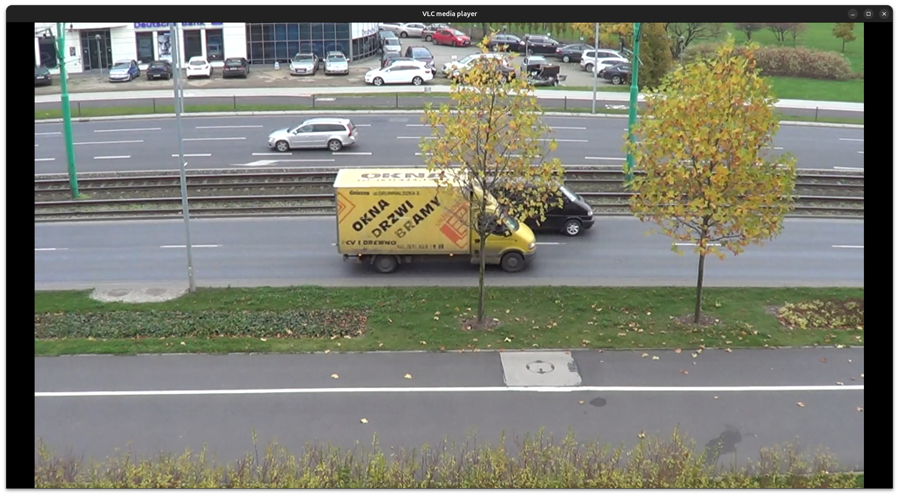

# Object counting project
Repository for the allNBA team prediction project. Project is part of the Computer Vision course at the Poznan University of Technology.

## Project description
The project aims to count moving objects on the road. Project was prepared to count passing objects near Poznań University Of Technology building with a view like on the photo below. Project was intended to base on ready solutions for contour picking and tracking bounding boxes but needs were more demanding. Own Tracker has been written. Entire report written in Polish can be found in the doc folder. [Report link](doc/README.md)

## Project structure
- `lib`: Contains the core source code and main logic for the project.
- `doc`: Includes the project report and additional documentation.
- `output`: Includes outputs ideal and developed during the project making.
- `main.py`: The main script that finds the best machine learning model and prints the results.
- `requirements.txt`: Lists all required Python packages to run the project.

>**Note:** The project is designed to be run in a Python 3.8 environment. Ensure that you have the correct version of Python installed.

> [!IMPORTANT]
> Key information users need to know to achieve their goal.

> [!WARNING]
> Urgent info that needs immediate user attention to avoid problems.

> [!CAUTION]
> Advises about risks or negative outcomes of certain actions.